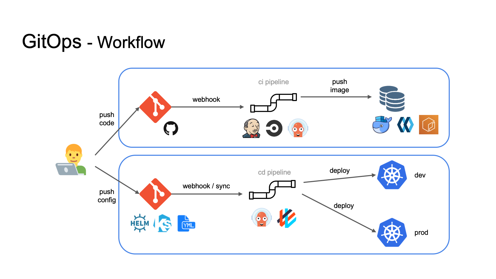

{}
이미 많은 수의 개발자는 Application 개발을 위해 Git 을 사용 하고 있다.
그리고 최근 Infrastructure 를 코드로 관리하는 방법이 소개 되었고 사용되고 있다. (IaC)
하지만 배포 과정에서는 다양한 방법이 있고 각기 다른 방법으로 관리 하고 있다.
그래서 GitOps 는 배포 과정의 환경까지도 Git 으로 관리하는 방법을 제시하고 있다.
{}

## GitOps

* GitOps 라는 용어는 [Waveworks](https://www.weave.works/technologies/gitops/) 에서 창안
* GitOps 의 핵심은 코드로 표현한 환경
* 즉, Git 저장소에 Kubernetes 매니페스트와 같은 파일을 사용하여 `환경을 선언적`으로 기술 한다는 개념

#### 저장소

* Application Repo : 어플리케이션의 소스 코드 저장소
* Infrastructure Repo : 인프라 구성용 소스 코드 저장소 (IaC)
* Environment Repo : 환경 선언용 소스 코드 저장소

#### 이점

* 생산성 향상 - 통합 피드백 루프를 통한 지속적인 배치
* 향상된 개발자 경험 - Git 과 같은 익숙한 도구로 코드를 푸시
* 향상된 안정성 - Git Workflow 로 변경 사항 추적 (누가 무엇을 언제)
* 신뢰성 향상 - Git 을 통한 배포 와 롤백, 복구 지점
* 일관성 및 표준화 - 앱, 인프라, 환경변수 등을 Git을 통해 관리
* 강력한 보안 보장 - Git 의 정확성과 보안 보장을 활용

